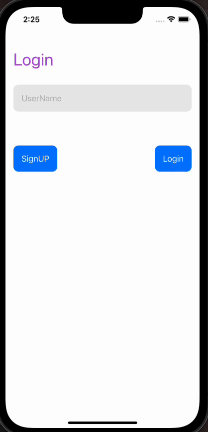

# SwiftUI Coordinator Master Example

This is a documentation file for a SwiftUI app that follows a centralised coordinator and view model based demo. The demo utilizes various navigation patterns, including a navigation stack and path. Additionally, custom navigation modifiers have been implemented, and a navigation configuration has been added. The app also includes a demo for a tab bar.

## Table of Contents 

- [Demo](#Demo)
- [Features](#Features)
- [Installation](#Installation)
- [Usage](#Installation)
- [Contributing](#Contributing)
- [Need Help / Support?](#need-help)
- [Collection of Components](#collection-of-Components)
- [License](#License)
- [Acknowledgements](#Acknowledgements)
- [Keywords](#keywords)

# Demo 📱



# Features 🥳

Briefly describe the main features of your SwiftUI project. For example:
* Centralised Coordinator Pattern
* Navigation Pattern with navigation stack and path
* More custom navigation modifiers
* Navigation Helper for the app
* Demo based on Tabbar and View model
* Minimum iOS Target 16.0

# Installation 💾

Provide instructions on how to install or integrate your project. For example:
    * Clone the repository.
    * Open the project in Xcode.
    * Build and run the project.

# Usage 👩🏾‍🔬

Once the app is running, you can explore complete navigation concept.

## Centralised Coordinator Pattern
The app utilises a centralised navigation communicator and view model. This demo ensures that the navigation logic is separated from the views and handled by a dedicated communicator and view model. This allows for a more organised and modular structure, making it easier to manage the app's navigation. 
This allows to reuse easy way in any project. Just drag and drop the folder `AppCoordinator` into your project and use as per your requirement.

### Defining the coordinator
Example using a Navigation Stack.

```swift
 struct AppContentView: App {
    @ObservedObject var coordinator = BaseCoordinator()
    var body: some Scene {
        WindowGroup {
            NavigationStack(path: $coordinator.path) {
                ZStack {
                    appContent()
                        .sheet(item: $coordinator.presentSheetItem) { present in
                            ViewFactory.viewForDestination(present)
                        }
                        .fullScreenCover(item: $coordinator.fullCoverItem) { present in
                            ViewFactory.viewForDestination(present)
                        }
                }
                .navigationDestination(for: DestinationFlowPage.self) { destination in
                    ViewFactory.viewForDestination(destination)
                }
            }
            .environmentObject(coordinator)
        }
    }
```

### Coordinator Accessibility: 
Can able to access anywhere and use that properties.

```swift
 @EnvironmentObject var coordinator: BaseCoordinator
 ```

## Navigation Pattern with Navigation Stack and Path

The navigation pattern used in the app incorporates a navigation stack and path. The navigation stack keeps track of the view hierarchy, allowing for seamless navigation between screens. The path represents the current navigation state and is used to control the flow of the app.

## Custom Navigation Modifiers

Custom navigation modifiers have been implemented in the app to provide additional functionality and customisation options for navigation. These modifiers can be applied to SwiftUI views to modify their navigation behavior, appearance, and transitions.

## Navigation Helper

The app includes a navigation configuration feature that allows for customisation of the navigation experience. The configuration options include setting the navigation bar style, defining the navigation stack behavior, and configuring other navigation-related settings.

## Tab Bar Demo

The app provides a tab bar demo, showcasing the use of a tab bar interface. The demo includes multiple tabs, each representing a different section or feature of the app. You can switch between tabs to explore the different parts of the application.

# Contributing

- Created something awesome, made this code better, added some functionality, or whatever (this is the hardest part).
- [Fork it](http://help.github.com/forking/).
- Create new branch to contribute your changes.
- Commit all your changes to your branch.
- Submit a [pull request](http://help.github.com/pull-requests/).


# Need Help? 

We also provide a free, basic support for all users who want to use this coordinator master demo in project. In case you want to customize this demo input to suit your development needs, then feel free to contact our [iOS SwiftUI Developers](https://www.weblineindia.com/hire-ios-app-developers.html).

# Collection of Components

 We have built many other components and free resources for software development in various programming languages. Kindly click here to view our [Free Resources for Software Development.](https://www.weblineindia.com/software-development-resources.html)
 
# Changelog

 Detailed changes for each release are documented in [CHANGELOG](./CHANGELOG).

# License 📃

This project is licensed under the MIT License. Feel free to use, modify, and distribute the code as permitted by the license.

# Acknowledgements

This app was created using SwiftUI and leverages various libraries and resources. We would like to acknowledge and express our gratitude to the following:
* SwiftUI: Apple's declarative framework for building user interfaces.
* Xcode: Integrated development environment (IDE) provided by Apple.
* Open-source libraries: Various open-source libraries and frameworks used in the project.
* Community contributors: Contributors who have provided support, bug fixes, and enhancements.

# Keywords

Coordinator Master, SwiftUI, Coordinator-ViewModel Pattern, Coordinator Pattern, Centralise Coordinator, Navigation Patten, Navigation Master, Navigation Stack, Navigation Reusable Component, SwiftUI Tabbar, Swift5, iOS 16, WeblineIndia
